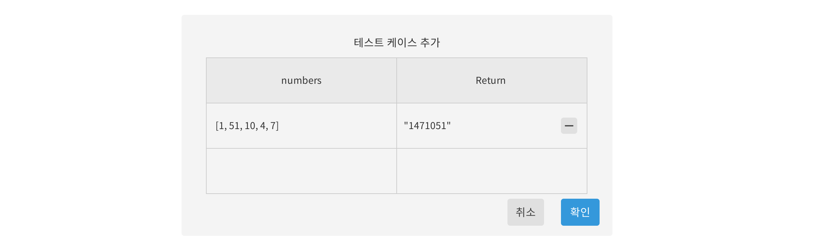

# Code Expert

## 프로젝트 개요
[프로그래머스](https://programmers.co.kr/), [백준](https://www.acmicpc.net/), [코드 업](https://codeup.kr/)과 같은 알고리즘 테스트 앱 클론 프로젝트 
|내용|설명|
|:---:|:---:|
|프로젝트 이름|Code Expert|
|프로젝트 기간|2020-06-16 ~ |

### 기술 스택
|내용|설명|
|:---:|:---:|
| 백엔드 |Spring Boot, Spring Data JPA, Spring Security, GraphQL, Restful, MySQL|
| 프론트엔드 |React.js, React Redux, Javascript, AJAX, HTML, CSS|

### 앱 기능
|내용|설명|
|:---:|:---:|
| 사용자 회원 가입 / 회원 탈퇴 | 회원가입 시, 알고리즘 출제, 알고리즘 테스트 권한 획득 |
| 사용자 로그인 / 로그아웃 | 로그인 시 사용자 프로필 표시(회원 이름, 푼 문제 수) |
| 문제 출제 | 출제자가 문제, 사진, 테스트케이스 추가 |
| 문제 목록 표시 | 유형 별 문제, 전체 문제 표시, 해결한 문제는 체크 표시, 해결한 사람들이 몇 명인지 표시 |
| 문제 풀기 | 문제를 보고 코드 작성, 테스트 케이스 추가 |
| 문제 채점 | 테스트 케이스가 모두 맞으면 통과 처리, 채점은 서버 내 컴파일러 사용 |
| 다른 사람의 풀이 | 다른 사람이 푼 코드 목록을 볼 수 있고 코드마다 댓글 표시 |

### 디자인 설계 (진행 중)

접기/펼치기

<!--summary 아래 빈칸 공백 두고 내용을 적는공간-->
설계 툴: [Oven](https://ovenapp.io/)  

#### 아이콘 (favicon)

#### 상단 바

    

#### 문제 출제 화면

    

#### 문제 목록 화면

    

#### 알고리즘 테스트 화면

    

##### 테스트케이스 추가 창

    

#### 다른 사람의 풀이 화면

    

#### 회원 가입 화면

    

#### 로그인 화면

    

#### 계정 관리 화면

    

