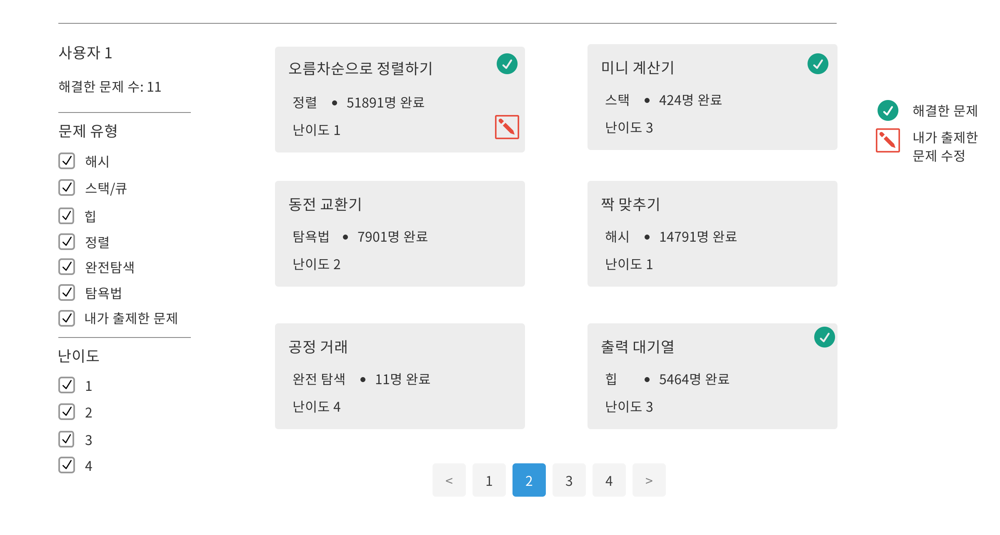
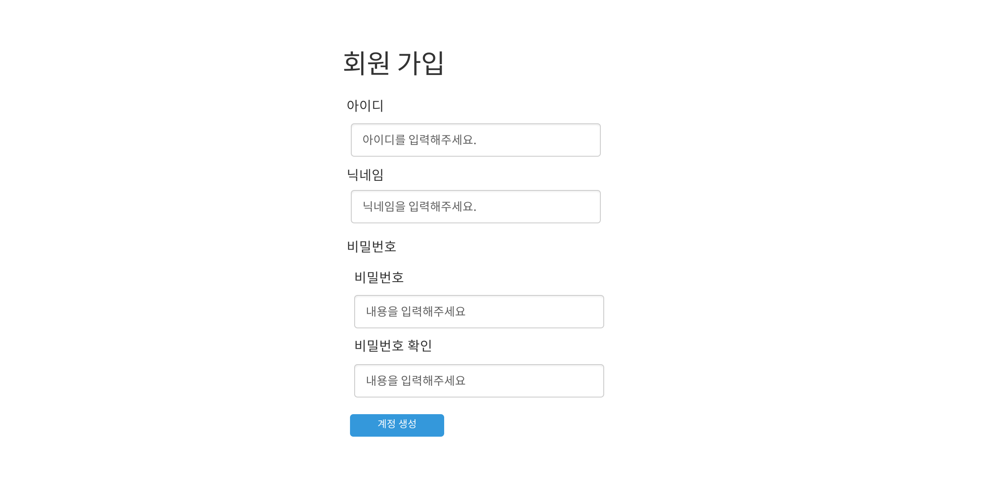

# Code Expert

## 배포된 서버
http://ec2-13-124-43-63.ap-northeast-2.compute.amazonaws.com/

## 프로젝트 개요
[프로그래머스](https://programmers.co.kr/), [백준](https://www.acmicpc.net/), [코드 업](https://codeup.kr/), [Codility](https://www.codility.com/)과 같은 알고리즘 테스트 웹서비스 클론 프로젝트 
|내용|설명|
|:---:|:---:|
|프로젝트 이름|Code Expert|
|프로젝트 기간|2020-06-16 ~ 2020-08-24|

## 기술 스택
|내용|설명|
|:---:|:---:|
| 백엔드 |Spring Boot, Spring Data JPA, Spring Security, GraphQL API, Rest API, MySQL|
| 프론트엔드 |React.js, React Redux, Redux Saga, Javascript, AJAX, HTML, CSS|
| 배포 방법 | Amazon EC2, Amazon RDS |
## 웹서비스 기능
|내용|설명|
|:---:|:---:|
| 사용자 회원 가입 | 회원가입 시, 알고리즘 출제, 알고리즘 테스트 권한 획득 |
| 사용자 로그인 / 로그아웃 | 로그인 시 사용자 프로필 표시(회원 이름, 푼 문제 수) |
| 계정 관리 | 닉네임 변경, 비밀번호 변경, 회원 탈퇴 메뉴 표시|
| 문제 출제, 수정, 삭제 | 출제자가 문제, 사진, 테스트케이스 , 입출력 예시, 제한 사항 추가 |
| 문제 목록 표시 | 유형 별 문제, 전체 문제 표시, 해결한 문제는 체크 표시, 해결한 사람들이 몇 명인지 표시 |
| 문제 풀기 | 문제를 보고 코드 작성 및 채점 |
| 문제 채점 | 입출력 예시 케이스, 테스트 케이스, 제한 시간, 메모리 제한을 모두 만족하면 통과 처리, 채점은 서버 내 컴파일러 사용 |
| 다른 사람의 풀이 | 다른 사람이 푼 코드 목록을 볼 수 있고 코드마다 댓글 표시. 좋아요 수 표시 |

## 디자인 설계
<details markdown="1">
<summary>접기/펼치기</summary>

<!--summary 아래 빈칸 공백 두고 내용을 적는공간-->
설계 툴: [Oven](https://ovenapp.io/)<br><br>

### 아이콘 (favicon)


### 상단 바
<p align="center">
    
</p>

### 하단 바
<p align="center">
    
</p>


### 문제 출제 화면
<p align="center">
    
</p>


### 문제 목록 화면
<p align="center">
    
</p>

### 알고리즘 테스트 화면
<p align="center">
    
</p>

### 다른 사람의 풀이 화면
<p align="center">
    
</p>

### 회원 가입 화면
<p align="center">
    
</p>

### 로그인 화면
<p align="center">
    
</p>


### 계정 관리 화면
<p align="center">
    
</p>
</details>

## 데이터 구조
<details markdown="1">
<summary>접기/펼치기</summary>

<!--summary 아래 빈칸 공백 두고 내용을 적는공간-->
### EER 다이어그램


#### 엔티티 별 설명

##### user
사용자 정보 엔티티<br/>
|속성 이름|속성 설명|
|:---:|:---:|
| id(pk) | 사용자 아이디 |
| email | 사용자 이메일 |
| password | 사용자 비밀번호 |
| nickname | 사용자 닉네임 |
| role | 사용자 역할(ADMIN, USER) |
| created_date | 생성 날짜 |
| modified_date | 수정 날짜 |

##### problem
알고리즘 문제 정보 엔티티<br/>
|속성 이름|속성 설명|
|:---:|:---:|
| id(pk) | 문제 아이디 |
| title | 문제 제목 |
| content | 문제 내용 |
| limit_explain | 제한 사항 설명 |
| time_limit | 시간 제한(ms) |
| memory_limit | 메모리 제한(MB) |
| created_date | 생성 날짜 |
| modified_date | 수정 날짜 |
| problem_level_id(fk) | 문제 난이도 아이디(problem_level) |
| problem_type_id(fk) | 문제 유형 아이디(problem_type)|
| creator_id(fk) | 출제자 아이디(user) |

##### problem_level
알고리즘 문제 난이도 엔티티<br/>
|속성 이름|속성 설명|
|:---:|:---:|
| id(pk) | 문제 난이도 아이디 |
| name | 난이도명(1~4) |

##### problem_type
알고리즘 문제 유형 엔티티<br/>
|속성 이름|속성 설명|
|:---:|:---:|
| id(pk) | 문제 유형 아이디 |
| name | 문제 유형 |

##### problem_paramter
파라미터 명, 자료형 엔티티<br/>
문제를 채점할 때(정답 목록)와 문제 예시(입출력 예시)에 사용된다.<br/>
table_type 속성으로 둘을 구분한다.<br/>
|속성 이름|속성 설명|
|:---:|:---:|
| id(pk) | 파라미터 아이디 |
| name | 파라미터 명(변수명) |
| table_type | 채점할 때 사용되면 'a', 문제 설명에 사용되면 'e' |
| data_type_id(fk) | 자료형 아이디(datatype) |
| problem_id(fk) | 문제 아이디(problem_id) |

##### problem_return
반환될 변수의 자료형 엔티티<br/>
문제를 채점할 때(정답 목록)와 문제 예시(입출력 예시)에 사용된다.<br/>
table_type 속성으로 둘을 구분한다.<br/>
|속성 이름|속성 설명|
|:---:|:---:|
| id(pk) | 리턴 아이디 |
| table_type | 채점할 때 사용되면 'a', 문제 설명에 사용되면 'e' |
| data_type_id(fk) | 자료형 아이디 |
| problem_id(fk) | 문제 아이디(problem) |

##### problem_testase
테스트케이스(반환 값 정보) 엔티티
문제를 채점할 때(정답 목록)와 문제 예시(입출력 예시)에 사용된다.<br/>
table_type 속성으로 둘을 구분한다.<br/>
|속성 이름|속성 설명|
|:---:|:---:|
| id(pk) | 테스트케이스 아이디 |
| return value| 반환 값 |
| table_type | 채점할 때 사용되면 'a', 문제 설명에 사용되면 'e' |
| problem_id(fk) | 문제 아이디(problem) |

##### problem_parameter_value
파라미터 값 엔티티
문제를 채점할 때(정답 목록)와 문제 예시(입출력 예시)에 사용된다.<br/>
부모 엔티티인 problem_testcase의 table_type 속성으로 둘을 구분한다.
|속성 이름|속성 설명|
|:---:|:---:|
| id(pk) | 파라미터 값 아이디 |
| value | 파라미터 값 |
| problem_testcase_id(fk) | 테스트케이스 아이디(problem_testcase) |

##### code
사용자가 알고리즘 문제를 풀고 제출한 코드 엔티티<br/>
푼 결과가 맞았든 틀렸든 여기에 저장한다<br/>
사용자가 코드를 작성하다가 브라우저를 종료해도 여기서 불러올 수 있다.<br/>
|속성 이름|속성 설명|
|:---:|:---:|
| id(pk) | 코드 아이디 |
| content | 코드 내용 |
| is_init_code | 초기 코드 여부 |
| created_date | 생성 날짜 |
| modified_date | 수정 날짜 |
| creator_id | 코드 작성자 아이디 |
| language_id(fk) | 작성한 언어 아이디(language|
| problem_id(fk) | 문제 아이디(problem) |

##### language
코드 작성 시 사용한 언어(C++, Java, Python3) 엔티티<br/>
|속성 이름|속성 설명|
|:---:|:---:|
| id(pk) | 언어 아이디 |
| name | 언어 이름 |

##### data_type
파라미터, 반환되는 값의 자료형(int, double...) 엔티티<br/>
|속성 이름|속성 설명|
|:---:|:---:|
| id(pk) | 자료형 아이디 |
| name | 자료형 이름 |

##### solution
해결한 문제의 코드 정보 엔티티
코드 작성후 채점을 했을 때 테스트케이스를 모두 통과하면 여기에 저장한다.<br/>
다른 사람의 풀이 화면에서 사용한다.<br/>
|속성 이름|속성 설명|
|:---:|:---:|
| id(pk) | 솔루션 아이디 |
| created_date | 생성 날짜 |
| modified_date | 수정 날짜 |
| problem_id(fk) | 문제 아이디(problem) |
| creator_id(fk) | 푼 사람 아이디(user) |
| code_id(fk) | 코드 아이디(code) |

##### solution_comment
솔루션에 달린 댓글 엔티티
|속성 이름|속성 설명|
|:---:|:---:|
| id(pk) | 댓글 아이디 |
| content | 댓글 내용 |
| created_date | 생성 날짜 |
| modified_date | 수정 날짜 |
| solution_id(fk) | 솔루션 아이디(solution) |
| writer_id(fk) | 댓글 작성자 아이디(user) |

##### solution_like_user_info
솔루션에 좋아요 버튼을 누른 사용자 정보 엔티티
|속성 이름|속성 설명|
|:---:|:---:|
| id(pk) | 아이디 |
| like_solution_id(fk) | 좋아요 버튼이 눌린 솔루션 아이디(solution)|
| like_user_id(fk) | 좋아요 버튼을 누른 사용자 아이디(user) |

</details>
<br/>

## API 스펙
https://hch0821.gitbook.io/code-expert-api

### 알고리즘 테스트 컴파일러
* Java: openjdk 14.0.1
* Python: Python 3.8.2
* C++: clang 9.0.1-12

### 알고리즘 테스트 컴파일 옵션
* Java: ```java --illegal-access=warn FILENAME```
* Python: ```python3 FILENAME```
* C++: 
  컴파일: ```clang++ -pthread -std=c++1z -o OUTPUT_FILENAME```
  실행: ```./OUTPUT_FILENAME```

## 클론 후 앱 실행 방법(백엔드 & 프론트엔드)
반드시 유닉스 환경에서 실행.

1. openjdk 14.0.1, Python 3.8.2, clang 9.0.1-12, mysql 8 설치

2. [db 작업](https://cjh5414.github.io/mysql-create-user/)<br/>
-* spring.datasource.url에 명시된 db 이름대로 mysql에 db 생성<br/>
-* spring.datasource.username, spring.datasource.password에 명시된 db 사용자 이름, 비밀번호를 보고 사용자 생성.<br/>
-* 사용자에게 해당 db의 권한 모두 허락

3. 메이븐 설치
```bash
sudo apt install maven
```

4. 서버 및 클라이언트 빌드 후, 서버 클라이언트 모두 동봉된 war파일 실행
```bash
cd CodeExpert/backend
mvn clean
mvn install -DskipTests
sudo java -jar target/code.expert-0.0.1-SNAPSHOT.war # 포트 번호 80번은 sudo 권한 필요
```

5. 브라우저로 웹 서버 접속(포트: 80 - 생략 가능)<br/>
http://hostname/


## 배포
### 서버 배포 결과
http://ec2-13-124-43-63.ap-northeast-2.compute.amazonaws.com/

-* SSL은 금전적 문제로 적용 안 함.<br/>

### 서버 구성
</img>

### 서버 사양

#### Amazon EC2
|항목|내용|
|:---:|:---:|
|인스턴스 유형|t2.micro|
|vCPU| 1 개|
|시간당 CPU 크레딧| 6 |
| Memory | 1 GB |
| Storage | 8 GB |
|네트워크 성능 | 낮음에서 중간|
<br/>

#### Amazon RDS
|항목|내용|
|:---:|:---:|
|인스턴스 유형|db.t2.micro|
|vCPU| 1 개|
|시간당 CPU 크레딧| 6 |
| Memory | 1 GB |
| Storage | 20 GB |
|네트워크 성능 | 낮음에서 중간|

## 시연 영상
[](https://youtu.be/jxMuPeMyQEk "Code Expert")