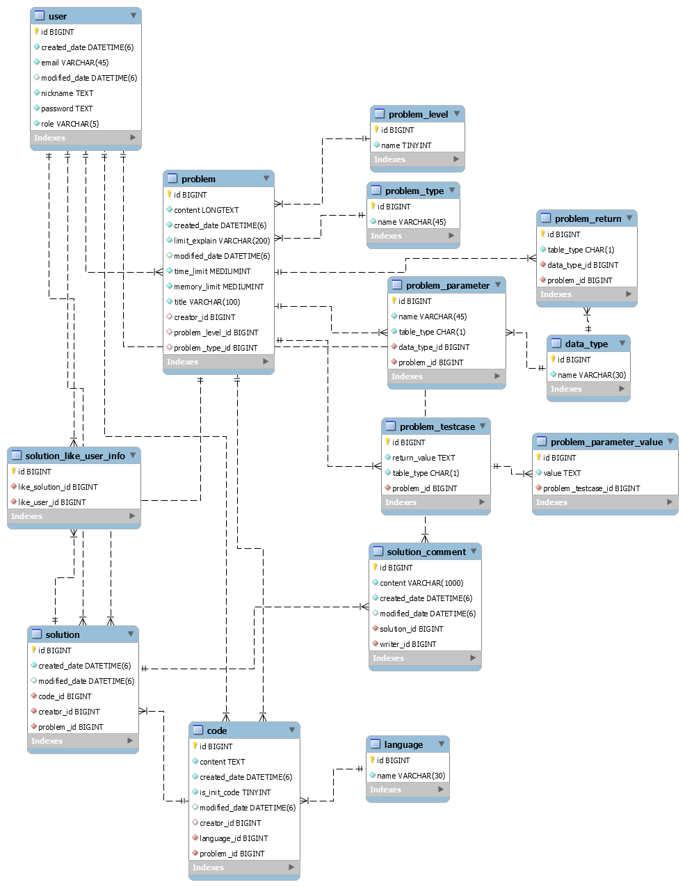

# Code Expert

## 프로젝트 개요
[프로그래머스](https://programmers.co.kr/), [백준](https://www.acmicpc.net/), [코드 업](https://codeup.kr/)과 같은 알고리즘 테스트 앱 클론 프로젝트 
|내용|설명|
|:---:|:---:|
|프로젝트 이름|Code Expert|
|프로젝트 기간|2020-06-16 ~ 2020-07|

### 기술 스택
|내용|설명|
|:---:|:---:|
| 백엔드 |Spring Boot, Spring Data JPA, Spring Security, GraphQL, Restful, MySQL|
| 프론트엔드 |React.js, React Redux, Javascript, AJAX, HTML, CSS|

### 앱 기능
|내용|설명|
|:---:|:---:|
| 사용자 회원 가입 | 회원가입 시, 알고리즘 출제, 알고리즘 테스트 권한 획득 |
| 사용자 로그인 / 로그아웃 | 로그인 시 사용자 프로필 표시(회원 이름, 푼 문제 수) |
| 계정 관리 | 닉네임 변경, 비밀번호 변경, 회원 탈퇴 메뉴 표시|
| 문제 출제 | 출제자가 문제, 사진, 테스트케이스 , 입출력 예시, 제한 사항 추가 |
| 문제 목록 표시 | 유형 별 문제, 전체 문제 표시, 해결한 문제는 체크 표시, 해결한 사람들이 몇 명인지 표시 |
| 문제 풀기 | 문제를 보고 코드 작성, 테스트 케이스 추가 |
| 문제 채점 | 테스트 케이스, 제한 시간, 제한 용량을 모두 만족하면 통과 처리, 채점은 서버 내 컴파일러 사용 |
| 다른 사람의 풀이 | 다른 사람이 푼 코드 목록을 볼 수 있고 코드마다 댓글 표시 |

### 디자인 설계

접기/펼치기

<!--summary 아래 빈칸 공백 두고 내용을 적는공간-->
설계 툴: [Oven](https://ovenapp.io/)  

#### 아이콘 (favicon)

#### 상단 바

    

#### 하단 바

    

#### 문제 출제 화면

    

#### 문제 목록 화면

    

#### 알고리즘 테스트 화면

    

#### 다른 사람의 풀이 화면

    

#### 회원 가입 화면

    

#### 로그인 화면

    

#### 계정 관리 화면

    

### 데이터 구조

접기/펼치기

<!--summary 아래 빈칸 공백 두고 내용을 적는공간-->
#### EER 다이어그램

##### 엔티티 별 설명

###### user
사용자 정보 엔티티 
|속성 이름|속성 설명|
|:---:|:---:|
| id(pk) | 사용자 아이디 |
| email | 사용자 이메일 |
| password | 사용자 비밀번호 |
| nickname | 사용자 닉네임 |
| role | 사용자 역할(ADMIN, USER) |
| created_date | 생성 날짜 |
| modified_date | 수정 날짜 |

###### problem
알고리즘 문제 정보 엔티티 
|속성 이름|속성 설명|
|:---:|:---:|
| id(pk) | 문제 아이디 |
| title | 문제 제목 |
| explain | 문제 설명 |
| limit_explain | 제한 사항 설명 |
| time_limit | 시간 제한(ms) |
| memory_limit | 메모리 제한(MB) |
| created_date | 생성 날짜 |
| modified_date | 수정 날짜 |
| problem_level_id(fk) | 문제 난이도 아이디(problem_level) |
| problem_type_id(fk) | 문제 유형 아이디(problem_type)|
| creator_id(fk) | 출제자 아이디(user) |

###### problem_resolved_user_info
알고리즘 문제를 해결한 사람들 정보 엔티티 
|속성 이름|속성 설명|
|:---:|:---:|
| id(pk) | 아이디 |
| resolved_problem_id(fk) | 해결한 문제 아이디(problem) |
| resolved_user_id(fk) | 문제 해결한 사용자의 아이디(user) |

###### problem_image
알고리즘 문제에 첨부된 이미지 엔티티 
|속성 이름|속성 설명|
|:---:|:---:|
| id(pk) | 이미지 아이디 |
| file_name | 원본 파일 이름 |
| save_file_name | 서버에 저장된 파일 이름 |
| content_type | 파일 확장명 |
| created_date | 생성 날짜 |
| problem_id(fk) | 이미지가 첨부된 문제 아이디(problem) |

###### problem_level
알고리즘 문제 난이도 엔티티 
|속성 이름|속성 설명|
|:---:|:---:|
| id(pk) | 문제 난이도 아이디 |
| name | 난이도명(1~4) |

###### problem_type
알고리즘 문제 유형 엔티티 
|속성 이름|속성 설명|
|:---:|:---:|
| id(pk) | 문제 유형 아이디 |
| name | 문제 유형 |

###### problem_paramter
파라미터 명, 자료형 엔티티 
문제를 채점할 때(정답 목록)와 문제 예시(입출력 예시)에 사용된다. 
group 속성으로 둘을 구분한다. 
|속성 이름|속성 설명|
|:---:|:---:|
| id(pk) | 파라미터 아이디 |
| name | 파라미터 명(변수명) |
| group | 채점할 때 사용되면 'a', 문제 설명에 사용되면 'e' |
| datatype_id(fk) | 자료형 아이디(datatype) |
| problem_id(fk) | 문제 아이디(problem_id) |

###### problem_return
반환될 변수의 자료형 엔티티 
문제를 채점할 때(정답 목록)와 문제 예시(입출력 예시)에 사용된다. 
group 속성으로 둘을 구분한다. 
|속성 이름|속성 설명|
|:---:|:---:|
| id(pk) | 리턴 아이디 |
| group | 채점할 때 사용되면 'a', 문제 설명에 사용되면 'e' |
| data_type_id(fk) | 자료형 아이디 |
| problem_id(fk) | 문제 아이디(problem) |

###### problem_testcase
테스트케이스(반환 값 정보) 엔티티
문제를 채점할 때(정답 목록)와 문제 예시(입출력 예시)에 사용된다. 
group 속성으로 둘을 구분한다. 
|속성 이름|속성 설명|
|:---:|:---:|
| id(pk) | 테스트케이스 아이디 |
| return value| 반환 값 |
| group | 채점할 때 사용되면 'a', 문제 설명에 사용되면 'e' |
| problem_id(fk) | 문제 아이디(problem) |

###### problem_parameter_value
파라미터 값 엔티티
문제를 채점할 때(정답 목록)와 문제 예시(입출력 예시)에 사용된다. 
부모 엔티티인 problem_testcase의 group 속성으로 둘을 구분한다.
|속성 이름|속성 설명|
|:---:|:---:|
| id(pk) | 파라미터 값 아이디 |
| value | 파라미터 값 |
| problem_testcase_id(fk) | 테스트케이스 아이디(problem_testcase) |

###### code
사용자가 알고리즘 문제를 풀고 제출한 코드 엔티티 
푼 결과가 맞았든 틀렸든 여기에 저장한다 
사용자가 코드를 작성하다가 브라우저를 종료해도 여기서 불러올 수 있다. 
|속성 이름|속성 설명|
|:---:|:---:|
| id(pk) | 코드 아이디 |
| content | 코드 내용 |
| created_date | 생성 날짜 |
| modified_date | 수정 날짜 |
| language_id(fk) | 작성한 언어 아이디(language|
| problem_id(fk) | 문제 아이디(problem) |

###### language
코드 작성 시 사용한 언어(C++, Java, Python3) 엔티티 
|속성 이름|속성 설명|
|:---:|:---:|
| id(pk) | 언어 아이디 |
| name | 언어 이름 |

###### datatype
파라미터, 반환되는 값의 자료형(int, double...) 엔티티 
|속성 이름|속성 설명|
|:---:|:---:|
| id(pk) | 자료형 아이디 |
| name | 자료형 이름 |

###### solution
해결한 문제의 코드 정보 엔티티
코드 작성후 채점을 했을 때 테스트케이스를 모두 통과하면 여기에 저장한다. 
다른 사람의 풀이 화면에서 사용한다. 
|속성 이름|속성 설명|
|:---:|:---:|
| id(pk) | 솔루션 아이디 |
| created_date | 생성 날짜 |
| modified_date | 수정 날짜 |
| problem_id(fk) | 문제 아이디(problem) |
| creator_id(fk) | 푼 사람 아이디(user) |
| code_id(fk) | 코드 아이디(code) |

###### solution_comment
솔루션에 달린 댓글 엔티티
|속성 이름|속성 설명|
|:---:|:---:|
| id(pk) | 댓글 아이디 |
| content | 댓글 내용 |
| created_date | 생성 날짜 |
| modified_date | 수정 날짜 |
| solution_id(fk) | 솔루션 아이디(solution) |
| writer_id(fk) | 댓글 작성자 아이디(user) |

###### solution_like_user_info
솔루션에 좋아요 버튼을 누른 사용자 정보 엔티티
|속성 이름|속성 설명|
|:---:|:---:|
| id(pk) | 아이디 |
| like_solution_id(fk) | 좋아요 버튼이 눌린 솔루션 아이디(solution)|
| like_user_id(fk) | 좋아요 버튼을 누른 사용자 아이디(user) |

